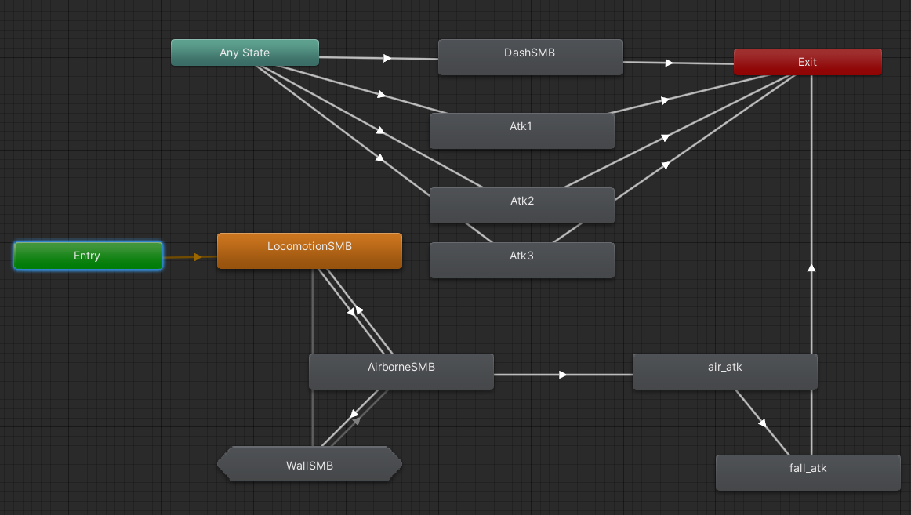
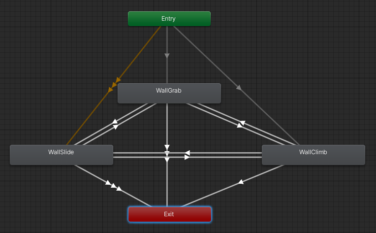
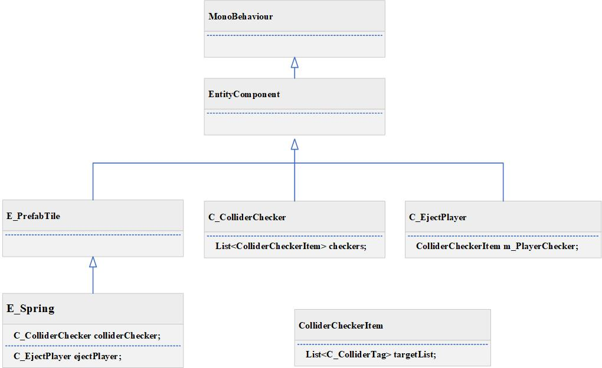

# Unity Demo

## 视频演示
<video src="Document/video/MyVideo_1.mp4" controls="controls" width="500" height="300"></video>


## 1.多层状态机(HFSM)实现人物状态切换
### 参考：[Unity官方2D项目GameKit2D](https://learn.unity.com/project/2d-you-xi-tao-jian)

### 1.1Animator
### 外层


### 内层



各状态继承自抽象类SealedSMB
```cpp
public abstract class SealedSMB : StateMachineBehaviour
{
    //进入
    public sealed override void OnStateEnter(Animator animator, AnimatorStateInfo stateInfo, int layerIndex) { }
    //状态执行
    public sealed override void OnStateUpdate(Animator animator, AnimatorStateInfo stateInfo, int layerIndex) { }
    //状态结束
    public sealed override void OnStateExit(Animator animator, AnimatorStateInfo stateInfo, int layerIndex) { }
}
```

### 1.2 PlayerCharacter实现人物行动逻辑

各个状态通过调用PlayerCharacter接口实现运动逻辑
```cpp
public class OnwallSMB : SceneLinkedSMB<PlayerCharacter>
{
    public override void OnSLStateNoTransitionUpdate(Animator animator, AnimatorStateInfo stateInfo, int layerIndex)
    {
        m_MonoBehaviour.GroundedHorizontalMovement(false); 
        m_MonoBehaviour.UpdateOnWallFacing();         //更新面朝方向
        m_MonoBehaviour.CheckForOnWallState();
        m_MonoBehaviour.CheckForGrounded();
        m_MonoBehaviour.CheckForWall();
        if (m_MonoBehaviour.CheckForJumpInput())
            m_MonoBehaviour.WallJump();
        else if (m_MonoBehaviour.CheckForDashInput())
            m_MonoBehaviour.Dash();

        //实现粒子效果
        //检查是否出现了蹬墙跳和冲刺逻辑
    }
}   
```
## 2. 人物移动/跳跃/冲刺逻辑
### 参考：[Celeste-Momvent-master](https://github.com/mixandjam/Celeste-Movement)


## 3. TileMap相关(弹簧/冲刺重置/地刺)
### 参考:[Tiny_Celeste_v3]https://github.com/casuak/Game_1_Tiny_Celeste_v3
碰撞检测(以弹簧为例)：
拥有三个组件E_Spring, C_ColliderChecker, C_EjectPlayer. E_Spring的Update更新C_ColliderChecker中获取到的触发对象, 需要提前在Unity中配置需要检测的对象.  C_EjectPlayer根据获取到的触发对象调用触发对象的接口. 由于不同的Tilemap都需要C_ColliderChecker的功能，因此单独分离出来.
### 3.1 UML类图

### 3.2 E_Spring.cs
```cpp
public class E_Spring : E_PrefabTile
    {
        void Update()
        {
            //检测是否与玩家进行碰撞，结果存放在 colliderChecker.checker.targetList
            colliderChecker.ColliderCheckerSystem();
            //根据targetList中获取到的碰撞体调用PalyerCharacter执行对应的逻辑
            ejectPlayer.EjectPlayerSystem();
        }
    }
```

### 3.3 C_EjectPlayer.cs
```cpp
public class C_EjectPlayer : EntityComponent
{
    private ColliderCheckerItem m_PlayerChecker;
    private void Awake()
    {
        //初始化 Spring 的ColliderChecker
        m_PlayerChecker = GetComponentNotNull<C_ColliderChecker>().GetChecker("Player Checker");
    }

    public void EjectPlayerSystem()
    {
            //从checker中获取碰撞检测的对象
            foreach (var tagContainer in m_PlayerChecker.targetList)
            {
                //根据ColliderCheckerItem的targetList获取到PlayerCharacter对象
                var player = (PlayerCharacter) tagContainer.GetEntityObject();
                ...
                //执行对应的触发弹簧的接口
                player.BeEjected(velocity);
            }
    }
}
```

## 4. 其他

### 4.1 敌人AI/子弹弹反
### 参考: [弹反](https://www.bilibili.com/video/BV1ES4y177Tx?spm_id_from=333.1007.top_right_bar_window_custom_collection.content.click&vd_source=1f4a7a119cba75354caa87a52ab8737c) 、 [AI](https://github.com/RedFF0000/Finite-state-machine)
<video src="Document/video/AI.mp4" controls="controls" width="500" height="300"></video>
<video src="Document/video/atk.mp4" controls="controls" width="500" height="300"></video>

### 4.2 跳跃修正,蹭墙跳
### 参考: [跳跃修正](https://www.bilibili.com/video/BV17Z4y1v7ox?spm_id_from=333.999.0.0)
